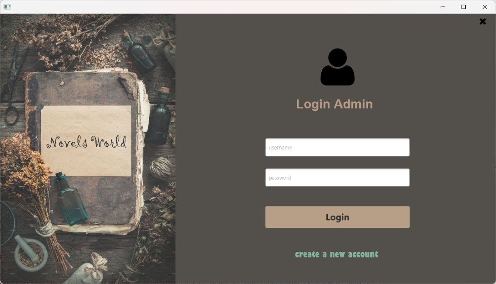
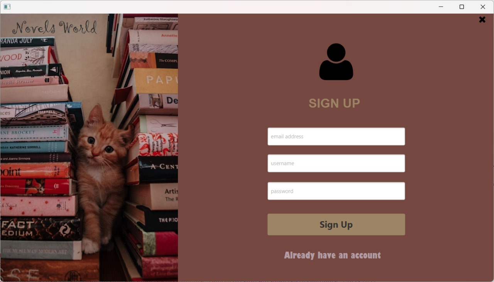
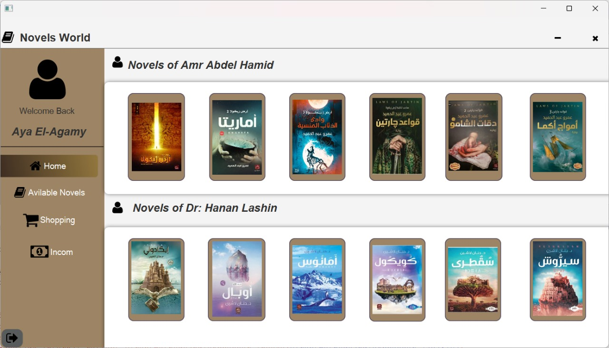
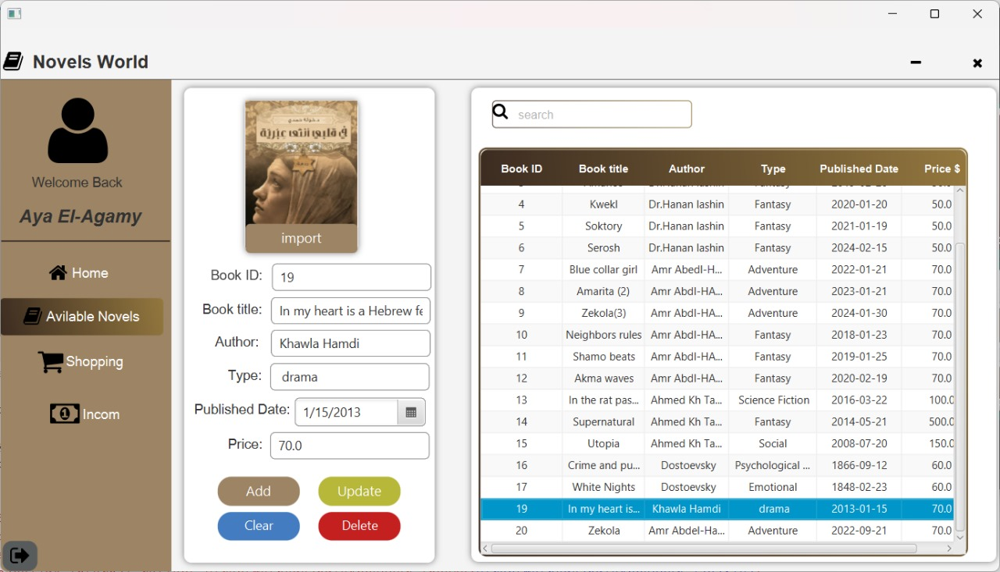
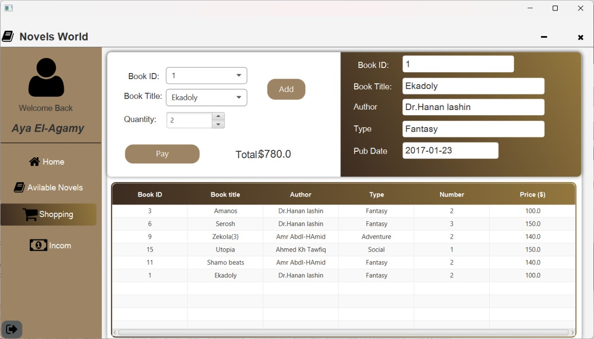
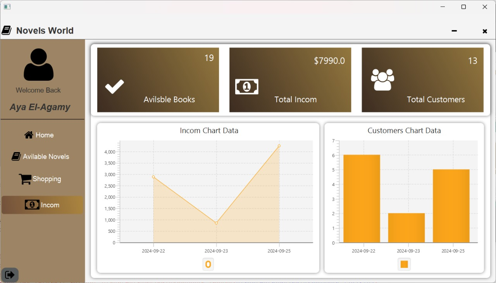

### Novels World Management System  

## Introduction:

The Novels World Management System is a desktop application designed for users to browse 
and purchase novels effortlessly. It facilitates interaction with novel content 
and equips administrators with tools to manage novels, register customers, 
and track sales revenue.

## Key Features:

<li>  User-Friendly Interface: 
  An intuitive design for smooth navigation across various sections.</li>

<li> Novel Management:  
  Administrators can add, update, and delete novels from the database.</li>

<li> Customer Registration:  
  Easy registration process for new customers with quick login capabilities.</li>

<li> Revenue Tracking:  
  Comprehensive reports on revenue and sales for administrators.</li>

<li> Popular Books Section: 
  A dedicated display of trending novels from renowned authors.</li>

## Screenshots:

Login  
  
Sign up  
   

## Main Interfaces:

<li> Home: 
   - Displays popular novels recently appreciated by readers.  
   - Features highlighted books from favorite authors, encouraging exploration.  </li>
   
  

<li> Available Books: 
   - Lists all books available on the site.  
   - Includes a search bar for easy access and allows admins to manage book entries.  </li>
   
  

<li>  Shopping: 
   - Users can search for books by ID or title and specify desired quantities.  
   - A direct "Pay" button facilitates the checkout process.  </li>
   
  

<li> Income: 
   - Enables administrators to monitor revenue accurately.  
   - Shows customer counts and available books, with a chart for visual financial representation.  </li>
   
  

  

## Used Library Files:

JFoenix 8.0.10: <a href = "https://github.com/Rakib-Hasan-455/Hotel_Management_System-JavaFx/raw/master/lib/jfoenix-8.0.10.jar"> Download </a> 
MySql JDBC Connector 8.0.26:  <a href = "https://github.com/Rakib-Hasan-455/Hotel_Management_System-JavaFx/raw/master/lib/mysql-connector-java-8.0.26.jar"> Download </a> 
FontAwesomeFX 8.9:  <a href = "https://github.com/Rakib-Hasan-455/Hotel_Management_System-JavaFx/raw/master/lib/fontawesomefx-8.9.jar"> Download </a> 
itextpdf-5.3.4:  <a href = "https://github.com/Rakib-Hasan-455/Hotel_Management_System-JavaFx/raw/master/lib/itextpdf-5.3.4.jar"> Download </a> 

## Requirements to Run this project/Jar/Exe file:
<li>Install MySql and ensure it runs on  <b>localhost:3306</b>  .</li>
<li><a href = ""> Download </a> 
 Novels World Management System Database and Install it into your MySql Database.</li>
<li> Your Java Version Must be 8 or above.</li>

## Tools and Technologies:
<li> Apache NetBeans IDE 20 </li>
<li> SceneBuilder 8.5 (for JFoenix 8.0.10 & java 8 compatible) </li>
<li> Java 8 </li>
<li> JavaFX </li>
<li> CSS </li>
<li> MySql </li>
<li> MySql JDBC Connector </li>
<li> JFoenix UI Components 8.0.10 </li>
<li> FontAwesome Font Components </li>

## Conclusion:
The Novels World Management System enhances the reading and purchasing experience
while simplifying management for administrators. It provides a seamless and 
efficient platform for exploring the world of novels.
